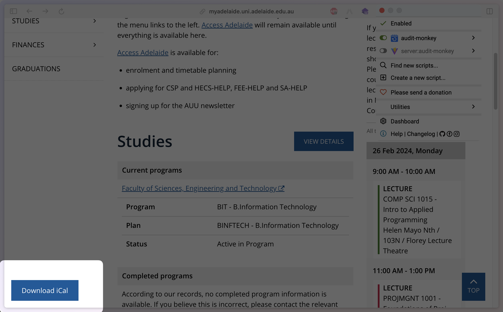

# 🗓️ AUDIT MONKEY 🙉

[Adelaide University Downloadable iCal Timetable](https://github.com/rayokamoto/AUDIT) Tampermonkey Script

## 🚀 Usage

### 💾 Download iCal

1. Install [Tampermonkey](https://www.tampermonkey.net/) for your browser.
2. Click the latest release `audit-monkey.user.js` in [Release](https://github.com/jsun969/audit-monkey/releases).
3. The Tampermonkey installation interface will popup when you click on the script file. Install it.

> [!NOTE]  
> If not, download the script then drag & drop it into the Tampermonkey dashboard.

4. Go to your [MyAdelaide](https://myadelaide.uni.adelaide.edu.au/) and login.
5. Click the `Download iCal` button at the bottom left.

### 📌 Import iCal

#### Google Calendar

1. Click the `Add other calendars` dropdown menu (plus icon) on the left-hand side of the screen.
2. Click `Create new calendar` and give it a name.
3. Back to the `Add other calendars` dropdown menu, click `Import`.
4. Click on the `Select file from your computer` button and choose the downloaded iCal file.
5. Choose the calendar where you want to add the imported events.
6. Click `Import` and wait for the calendar to import the events from the iCal file.

#### Apple Calendar

> [!TIP]  
> You can just simply click on the calendar file and it will be imported to your Apple Calendar.

1. Click on `File` in the top left corner of the screen.
2. Select `Import...` from the dropdown menu.
3. Choose the downloaded iCal file from your computer.
4. Choose the calendar where you want to add the imported events.
5. Click `Import` and wait for the calendar to import the events from the iCal file.

#### Outlook Calendar

1. Click `Add calendar`
2. Go to `Create blank calendar` tab and create a new calendar.
3. Go to `Upload from file` tab and upload the downloaded iCal file.
4. Select the calendar you created in step 2.
5. Click `Import` and wait for the calendar to import the events from the iCal file.

## 🙏 Thanks

Inspired by [AUDIT](https://github.com/rayokamoto/AUDIT) ~~and also stole a lot of code even icon from it~~
